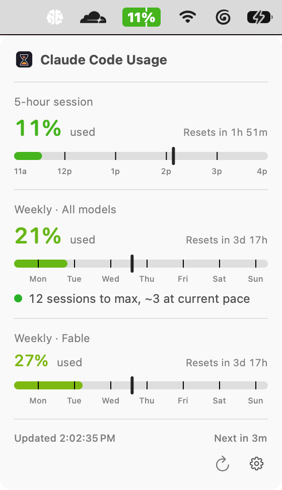
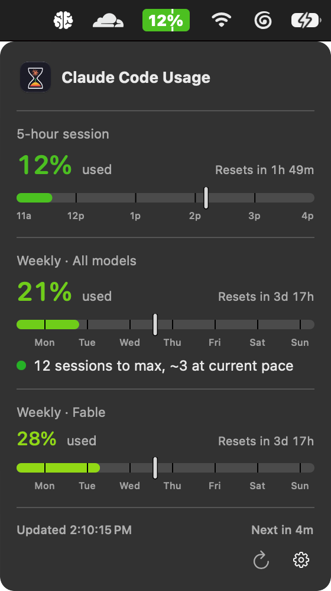

# Claude Code Usage (menubar)

A tiny macOS menubar app that shows how much Claude Code session quota you have
left, color-coded.

<p>
  
  
</p>

- Menubar text: percentage **used** in your current 5-hour session.
- Color is a smooth gradient keyed to usage: **green** (0%) → **yellow** (50%)
  → **orange** (70%) → **red** (90%) → **dark red** (100%). The same ramp colors
  the bars and the big percentages in the popover.
- Click the icon for: percent used in the 5-hour window with reset countdown,
  the weekly total + reset countdown, and per-model weekly (Opus / Sonnet) where
  your plan exposes them.
- Each bar has labeled gridlines (clock hours on the 5-hour bar, weekday names on
  the weekly bar) and a "you are here" tick showing how far you are through the
  window — fill past the tick means you're burning quota faster than the clock.
- The weekly section also shows a pace line: how many maxed sessions you'd need to
  hit 100%, and how many you're on track for at your current burn rate.
- Refreshes about every five minutes. The usage endpoint is rate-limited
  **per access token**, so on a 429 the app rotates its OAuth token (which
  resets the budget) and retries — see *How it gets the data* below.
- OAuth access tokens are refreshed automatically (proactively when expired,
  on a 401, or on a 429), and the rotated tokens are written back to the app's
  own Keychain item.

## How it gets the data

The app runs its **own** OAuth login against Claude and stores the resulting
tokens in its own Keychain item (`ClaudeUsage-credentials`) — separate from the
`Claude Code-credentials` item the `claude` CLI uses. It does **not** read or
write Claude Code's credentials.

> **Why a separate login?** The usage endpoint rate-limits per access token
> (~5 requests before a 429 with a long Retry-After). Resetting that budget
> means rotating the token. If we rotated Claude Code's shared token we'd race
> the CLI's own one-time-use refresh and break its auth — so the app owns its
> tokens instead, and can rotate freely.

**First run — connect your account:** the popover shows a *Connect your Claude
account* screen.

1. Click **Open Anthropic sign-in**. Your browser opens to Claude's OAuth
   consent page.
2. Approve. You'll land on a page showing an authorization code (formatted
   `code#state`).
3. Copy the whole string, paste it into the app's field, and click **Connect**.

The app exchanges that code for an access + refresh token pair, stores them in
`ClaudeUsage-credentials`, and starts polling. You can re-link or switch
accounts anytime via the **⋯ → Disconnect account** menu in the popover.

On each refresh it then:

1. Reads the OAuth token from `ClaudeUsage-credentials`.
2. Calls `https://api.anthropic.com/api/oauth/usage` with that token.
3. Parses `five_hour`, `seven_day`, `seven_day_opus`, `seven_day_sonnet`.

No separate Anthropic developer registration is needed — the OAuth flow reuses
the same public `client_id` and hosted redirect the `claude` CLI itself uses.

## Build

Requires macOS 14+ and Xcode 15 / Swift 5.9+.

### One-time: create a code signing identity

The build signs the app with a self-signed identity so the Keychain ACL on the
app's `ClaudeUsage-credentials` item stays valid across rebuilds. Without this,
every `./build-app.sh` produces a different cdhash and macOS treats it as a
"new app" — you'd have to re-authorize the keychain item on every rebuild, and
stale entries pile up in its ACL.

In **Keychain Access.app**: menu → *Certificate Assistant* → *Create a
Certificate…*

- **Name:** `Claude Usage` — see the note below; this is what shows up in
  **Login Items**.
- **Identity Type:** Self Signed Root
- **Certificate Type:** Code Signing
- Check **Let me override defaults**, then bump **Validity Period** to
  something long (e.g. 3650 days) — when the cert expires, codesign
  verification fails and you'll start getting prompts again.

The cert and its private key land in your login keychain. You only do this
once per machine.

> **The cert's name is what macOS shows in Login Items.** The entry under
> *System Settings → General → Login Items → Allow in the Background* is
> labeled by the signing certificate's Common Name — **not** by the app's
> `CFBundleDisplayName`. If you sign with a personal Apple Developer cert (or
> name the self-signed cert after yourself), Login Items will show *your name*
> instead of the app's. Naming the cert `Claude Usage` makes the entry read
> "Claude Usage". Whatever you name it, point the build at it with
> `SIGN_IDENTITY` (see below) — the default is `ClaudeUsage Self-Signed`.

### Build the app

```bash
./build-app.sh
open ./ClaudeUsage.app
```

The script:
- runs `swift build -c release`
- assembles `ClaudeUsage.app/` with a proper `Info.plist` (`LSUIElement` so it
  doesn't show in the Dock)
- code-signs with the `ClaudeUsage Self-Signed` identity. Override the cert
  name with `SIGN_IDENTITY="Claude Usage" ./build-app.sh`, or put
  `SIGN_IDENTITY="Claude Usage"` in a gitignored `.env` (the script sources it
  automatically). The identity you sign with is what appears in Login Items.

The signature pins the Keychain ACL to the cert's hash, so the ACL entry
survives any number of rebuilds as long as you keep using the same cert.

For development you can also just `swift run`, but that produces an unsigned
binary — the menubar still works (the app calls
`NSApplication.setActivationPolicy(.accessory)`), but because the cdhash
changes each build you may be re-prompted to authorize the keychain item, and
in some cases have to reconnect your account.

## Install

After `./build-app.sh`:

```bash
# Move into /Applications
mv ClaudeUsage.app /Applications/

# Register a per-user LaunchAgent so it starts at login (and auto-restarts
# on crash, but not when you quit it from the menu).
mkdir -p ~/Library/LaunchAgents
cat > ~/Library/LaunchAgents/com.jakemoffatt.claudeusage.plist <<'PLIST'
<?xml version="1.0" encoding="UTF-8"?>
<!DOCTYPE plist PUBLIC "-//Apple//DTD PLIST 1.0//EN" "http://www.apple.com/DTDs/PropertyList-1.0.dtd">
<plist version="1.0">
<dict>
  <key>Label</key>
  <string>com.jakemoffatt.claudeusage</string>
  <key>ProgramArguments</key>
  <array>
    <string>/Applications/ClaudeUsage.app/Contents/MacOS/ClaudeUsage</string>
  </array>
  <key>RunAtLoad</key>
  <true/>
  <key>KeepAlive</key>
  <dict><key>SuccessfulExit</key><false/></dict>
  <key>ProcessType</key>
  <string>Interactive</string>
  <key>StandardOutPath</key>
  <string>/tmp/claudeusage.out.log</string>
  <key>StandardErrorPath</key>
  <string>/tmp/claudeusage.err.log</string>
</dict>
</plist>
PLIST

# Bootstrap the agent (starts the app immediately and at every login).
launchctl bootstrap gui/$(id -u) ~/Library/LaunchAgents/com.jakemoffatt.claudeusage.plist
```

The first time it runs, the popover shows the *Connect your Claude account*
screen — follow the OAuth steps in [How it gets the data](#how-it-gets-the-data).
macOS may also show a Keychain Access dialog when the app first writes its
`ClaudeUsage-credentials` item; click **Always Allow** and it'll be silent
thereafter.

The LaunchAgent shows up in **System Settings → General → Login Items →
Allow in the Background** (toggleable from the UI if you want to disable
it temporarily).

## Uninstall

```bash
launchctl bootout gui/$(id -u)/com.jakemoffatt.claudeusage
rm ~/Library/LaunchAgents/com.jakemoffatt.claudeusage.plist
rm -rf /Applications/ClaudeUsage.app
```

## Notes

- The 5-hour and weekly *limits* are enforced server-side by Anthropic. This
  app just reads the percentage Anthropic returns; it does not compute its
  own session windows from local JSONL.
- The app reads and writes its own `ClaudeUsage-credentials` Keychain item via
  the `SecItem` APIs directly (no `/usr/bin/security` shellout). Because the
  app is the only writer of that item, stable code-signing alone keeps the ACL
  sticky across token rotations — unlike the shared `Claude Code-credentials`
  item, which several tools write and which needed the `security` workaround.
- Tokens are obtained through the app's own OAuth login, so it never touches
  Claude Code's credentials and can't interfere with the `claude` CLI's auth.
